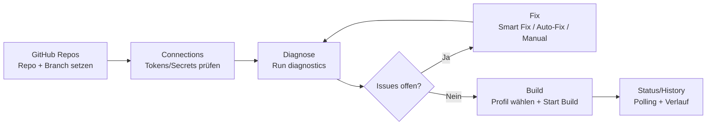

# 13 — Screen Flow Map (Build Journey)

Stand: 2026-03-02

## Flow (textuell)
1. **GitHub Repos**: Nutzer setzt `linkedRepo` + `linkedBranch`.
2. **Connections**: Tokens/Verbindungen validieren.
3. **Diagnose**: Checks ausführen.
4. **Fix Loop**: Smart Fix / Issue AutoFix / Manual Fix.
5. **Diagnose Recheck**: bis relevante Checks grün sind.
6. **Build**: Profil wählen und Build starten.
7. **Status/History**: Buildstatus und Historie prüfen.

## Mermaid

## Touchpoints / Hooks
- Repo selection: `screens/GitHubReposScreen/hooks/useGitHubReposScreen.ts`
- Diagnostics orchestration: `screens/DiagnosticScreen/hooks/useDiagnosticScreen.ts`
- Fix runner: `screens/DiagnosticScreen/hooks/useDiagnosticFixRunner.ts`
- Build gate/preconditions: `screens/EnhancedBuildScreen/hooks/useBuildPreconditions.ts`
- Service entry point: `project/services/buildStartService.ts`
