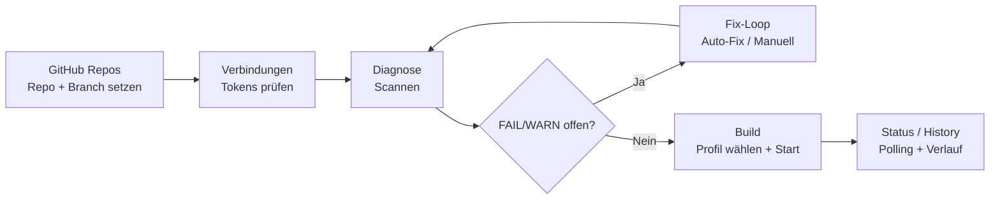

# 13 — Screen / Flow Map

Stand: **2026-04-02 (Docs Konsolidierung)**

## Screen-Matrix (Quick Nav)

| Screen | Zweck | Primäraktionen | Kritische Abhängigkeiten |
|---|---|---|---|
| `GitHub Repos` | Repo/Branch-SoT + Repo-Setup | Branch/Repo wählen, EAS-Link, Secret-Sync | Basis für `repo.*` Checks |
| `Verbindungen` | Token-/Connectivity-Status | Tokens testen/speichern | `local.*` Checks |
| `Diagnose` | Checklauf + Fix-Loop | `Scannen`, `Fixen`, `Auto-Fix` | Gate für Build-Freigabe |
| `Build` | Readiness + Build-Ausführung | `Build starten`, Retry/Cancel | selection-scoped Diagnostics, CI-Lite, Repo-Sync-Status, Signing, Build-Logs am aktiven Laufkontext |
| `Credentials Wizard` | Signing/Profil-Readiness | prüfen/ergänzen | Production Build |
| `Terminal` | Laufzeitbeobachtung | Logs lesen | Incident-/Debug-Pfad |

## End-to-End Flow

## Routing-Hinweise

- **`repo.*` / `local.*` rot:** zuerst Repo-/Token-Basis in `GitHub Repos`/`Verbindungen` korrigieren.
- **Preflight-Dateichecks rot:** in `Diagnose` über Issue-Details + Patch-Vorschau bearbeiten.
- **Build-Gate blockiert:** branch/diagnostic/CI-Lite/**repo-sync** prüfen, dann gezielt zurück in den passenden Screen.
- **Logs & Fehleranalyse:** bei aktivem Build bleiben Logs am Laufkontext; ohne `runId` zeigt der Screen bewusst nur einen Pending-Hinweis.
- **Chat:** Fehlerpfade behalten den Draft; Blur/Navigation aborten laufende Requests sichtbar und erhalten bereits vorhandene Plan-/Änderungsstände.
- **Preview:** Fullscreen ist nur für eine aktuell gültige Preview-Quelle aktiv.
- **ZIP-Import:** importierte Projekte werden vor Persistenz normalisiert, damit Import- und Load-Pfade denselben State-Vertrag nutzen.
