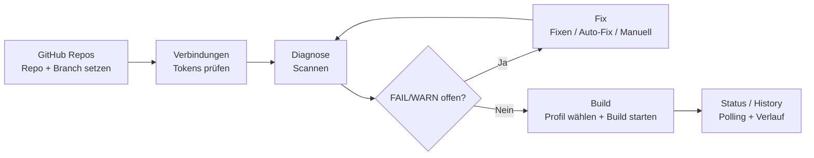

# 13 — Screen / Flow Map

Stand: 2026-03-02

## Screen-Matrix (Operator Quick Nav)

| Screen | Purpose | Primary Actions (Buttons) | Related services / hooks | Diagnostics touched |
|---|---|---|---|---|
| `GitHub Repos` | Repo/Branch-SoT setzen + Repo Ops | `EAS Projekt erstellen/verbinden`, `Secrets synchronisieren`, `Repo öffnen`, Branch/Repo Auswahl | `useGitHubReposScreen`, `listRepoSecretNames`, EAS-Link Actions | indirekt: Preconditions für alle `repo.*` checks |
| `Verbindungen` | Tokens/Connection-Status prüfen | Token testen/speichern (GitHub/Expo/Supabase) | Connection hooks + token services | `local.githubToken`, `local.expoToken`, `local.edgeAdminKey` |
| `Diagnose` | Vollständige Check-Ausführung + Fix-Loop | `Scannen`, `Fixen`, Issue-Details, `Auto-Fix anwenden`, `Patch Vorschau`, `KI-Fix` | `useDiagnosticScreen`, `useDiagnosticFixRunner`, `runPreflightChecksAll`, pipeline diagnostics | preflight IDs + pipeline IDs |
| `Build` | Build-Gate + Start + Verlauf | `Build starten`, One-Click `Deploy starten`, `Erneut versuchen`, `Abbrechen` | `useBuildPreconditions`, `useEnhancedBuildScreen`, `startBuildJob` | nutzt `diagnostic_last_ok`, Branch-Gate |
| `Terminal` | Laufende Logs/Operator-Debug | Log-Ansicht/Analyse | Terminal context/hooks | indirekt für Incident-Analyse |
| `Credentials Wizard` | Signing/Profil-Readiness | Profile wechseln/prüfen | Wizard hooks + storage helpers | beeinflusst Build-Readiness (Signing Keys) |

## End-to-End Flow (Mermaid)

## Check-ID Gruppen (für schnelles Routing)
- **Pipeline/Remote:** `local.*`, `repo.*`
- **Preflight/Local Files:** `core-package-json`, `entry-point`, `eas-profiles`, `assets-exist`, `security-forbidden-files`, `workflow-yaml-name-colon-quoting`, etc.

Siehe Detail-Mapping: `docs/07-diagnostics-fix-playbook.md`.
