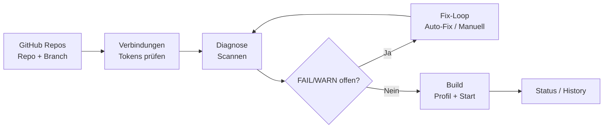

# 13 — Screen / Flow Map

Stand: 2026-03-12

## Screen-Matrix (Quick Nav)

| Screen | Purpose | Primäraktionen |
|---|---|---|
| `GitHub Repos` | Repo/Branch-SoT + Repo Ops | Repo/Branch wählen, EAS link/create, Secret-Sync |
| `Verbindungen` | Tokens/Connection-Status | Token testen/speichern |
| `Diagnose` | Checks + Fix-Loop | `Scannen`, `Fixen`, `Auto-Fix`, `Patch Vorschau` |
| `Build` | Gate + Start + Verlauf | `Build starten`, Retry/Cancel |
| `Terminal` | Laufende Logs/Debug | Logs filtern/lesen |
| `Credentials Wizard` | Signing-Readiness | Profile/Keys prüfen |

## End-to-End Flow

## Routing-Hinweis
- Pipeline/Remote: `local.*`, `repo.*`
- Preflight/Local Files: z. B. `core-package-json`, `entry-point`, `eas-profiles`, `workflow-yaml-name-colon-quoting`
- Details: `docs/07-diagnostics-fix-playbook.md`
